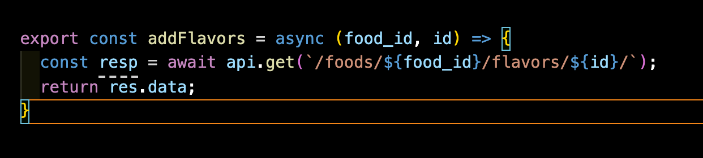
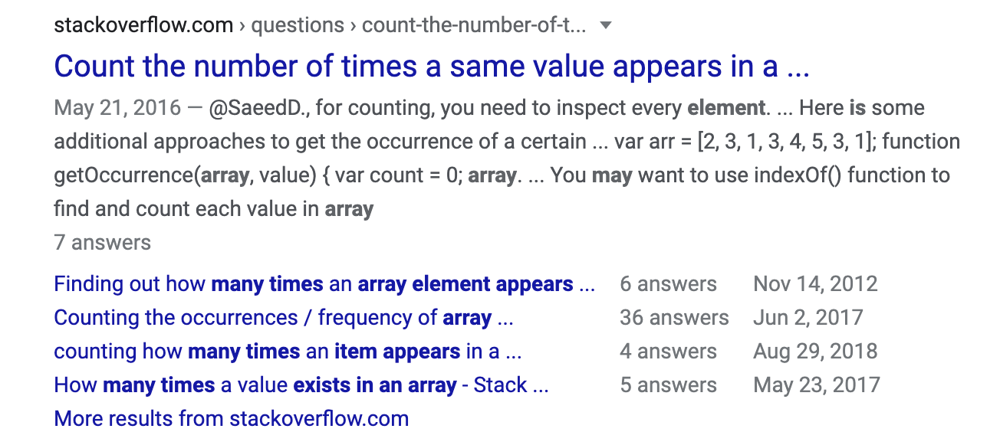

# Resources, Finding Answers, and Becoming an Effective Googler

##Professional Googler
Software engineering is a tremendous field.  It involves computer science, web architecture, an ever-increasing number of languages, frameworks, libraries, packages, IDEs, APIs, and other tools, and logic. Languages evolve new syntax and functions. Requirements for hosting and accessing third-party services change. New security measures emerge. Sometimes you need semi-colons, and sometimes you don't.  You can't know it all.

##Where do you go to learn?
###The docs

Documentation is a sometimes useful, sometimes frustrating tool that can guide you to set up, develop, and occasionally fix problems in your apps.

Javascript, Django, Vue, and Jquery all have great documentation, from both official and unofficial sources.

Documentation is extremely useful for approaching a new feature or method, and can be great to set up an app for the first time.  It's not where I would go to troubleshoot my app, but can be useful for very specific questions about how certain functions of languages and frameworks should be written, and information on data types.

###Teaching Sites
There are tons of sites, paid and unpaid, that will teach you software skills

- Youtube
- [Scrimba](https://scrimba.com/)
- [freeCodeCamp](https://www.freecodecamp.org/)
- [codeacademy](https://www.codecademy.com/)
- [Udemy](https://www.udemy.com/)

##Where do you go to fix?

###Your colleagues
Your colleagues are a great resource for help with problems.  Getting good at fixing bugs is often an experiential matter. Bugs are as unique and beautiful as we all are, and having seen a bug before is the best way to fix it in the future. This is another reason to be there to help your friends deal with their errors.

###Our Best Friend, Google
I was going to write a little thing about google here but you already know what google is.

##Becoming an effective googler
Becoming an effective googler is a 3-step process

- Identify the problem
- Phrase your search
- Navigate the results

###Identify the problem
####Errors
The terminal, the console, and our editor are our closest allys. Often, errors and exceptions allow us to quickly spot problems and often explain how to fix them ourselves:

Other times, the error provides a googleable phrase:

Sometimes, things just don't work, and we need to use our debugging skills to see why.

- Console log along the way
- Break down each step of the process to see where it breaks
- Use node or [repl](https://repl.it/~) to test things out.

###Phrase your search

- Always include the language or framework.
- Include the data type when applicable.
- Sort by date.
- Use formal terms when you can.
- Be complete.
- Pay attention to the autocomplete

###Navigate the results
Google results are, for us, going to fall into 4 categories:

- Documentation
- Articles (like Medium)
- Github issues (or similar setup)
- Stack overflow

####Articles
Articles are excellent for setting up apps, or adding features. Articles are sometimes useful for fixing sites, but often have way more information than we require.

####Github issues page
The generic brand of stack overflow. Can be very helpful for errors relating to packages or small libraries you're using.

###Stack overflow

Stack overflow is the best. It is the place to go for advice and code snippets.  Once you're able to scan pages to see if they're right for you, you can find whatever you need.

It's often useful to open a few stack overflow pages for each search, and scan through them for the best one.

####The scan
Once you've got your search results, whether it's stack overflow or otherwise, you want to start scanning. What you're looking for is a small, contained snippet of code.  On stack overflow, this is usually going to be the first answer one the page. If you're able to find this, evaluate the code, either by reasoning through it in your mind, in node, or in repl to see if it might be relevant to you.

At this point, if your problem isn't solved, you might want to read more on the page to see if it's explained what this code snippet is doing, and if it can be modified to meet your needs.

Even if it isn't, the page might contain certain terms that can enhance your next search.